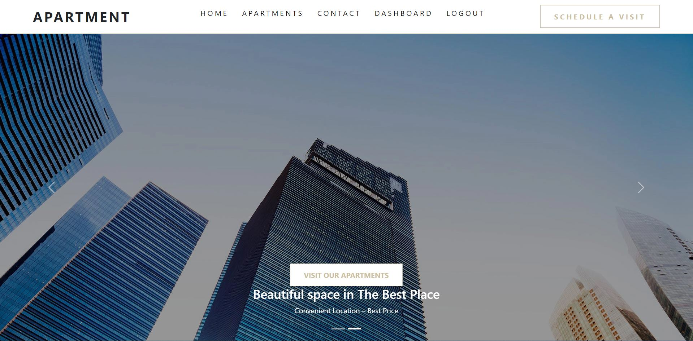

# Apartment

## Features :

<ul>Anyone can contact.</ul>
<ul>To schedule a visit to look at the apartment you have to login.</ul>
<ul>Users can register,login by filling up the form. Also users can login using google and github.</ul>
<ul>Without registering if a user wants to login using google automatically create a user account taking.</ul>
<ul>information from google/github.</ul>
<ul>After login, users can view their own profile and can update or delete accounts.Can take a schedule.</ul>
<ul>visit the apartment. And if users took a schedule to visit it’ll show the user's profile.</ul>
<ul>Admin can add an apartment. If necessary can update or delete any apartment.</ul>
<ul>Admin can make someone admin.</ul>
<ul>Admin can look at all the schedules which users have taken.</ul>
<ul>To Make someone Admin I used JWT token to to verify who wants to make admin, is he admin or not!</ul>

### Live Site Link : https://apartment-c3fc1.web.app/

